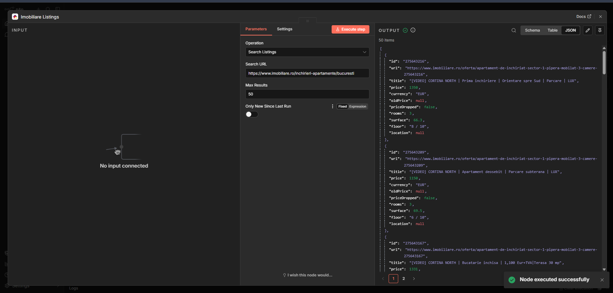

# n8n-nodes-imobiliare


Community [n8n](https://n8n.io) node for **imobiliare.ro**, Romania's largest real-estate
portal. Search property listings and detect new ones or price drops automatically — for
investors, buyers, and agents who otherwise refresh the site by hand. No API key.



## Nodes

| Node | What it does |
| --- | --- |
| [Imobiliare Listings](nodes/ImobiliareListings/README.md) | Search listings from a search URL (with price-drop + new-since-last-run detection) and fetch full listing details. |

## Installation

### From the n8n UI (recommended)

1. Go to **Settings → Community Nodes → Install**.
2. Enter `n8n-nodes-imobiliare` and confirm.
3. The **Imobiliare Listings** node appears in the node panel.

### With npm

```bash
npm install n8n-nodes-imobiliare
```

## Example workflow

[`workflows/imobiliareListings-example.json`](workflows/imobiliareListings-example.json) —
every 2 hours, search for new apartments matching your saved search; for each new
listing send a Telegram message and log it to a sheet for price tracking over time.
Import via **Workflows → Import from File** and swap the placeholders for your
Telegram / Google Sheets nodes.

## Local development

```powershell
cd <this-package>
npm install
npm run build
```

Run inside n8n via Docker:

```powershell
docker run -it --rm --name n8n -p 5678:5678 `
  -v n8n_data:/home/node/.n8n `
  -v "<ABSOLUTE_PACKAGE_PATH>:/home/node/.n8n/custom/n8n-nodes-imobiliare" `
  -e N8N_CUSTOM_EXTENSIONS="/home/node/.n8n/custom/n8n-nodes-imobiliare" `
  docker.n8n.io/n8nio/n8n
```

Open <http://localhost:5678>.

## Tests

```bash
npm test
```

Tests run against real imobiliare.ro snapshots (search cards + a listing's JSON-LD),
covering Romanian number/entity parsing, card extraction with price-drop detection, the
JSON-LD detail parser, and the new-since-last-run monitoring logic.

## Data & disclaimer

Data © imobiliare.ro (Realmedia Network S.A.). Unofficial package, not affiliated with
imobiliare.ro. The search parser reads server-rendered pages, so it can break if the
site changes its layout. Respect the site's terms of service and don't hammer it.

## License

[MIT](LICENSE) © Catalin Barabas
