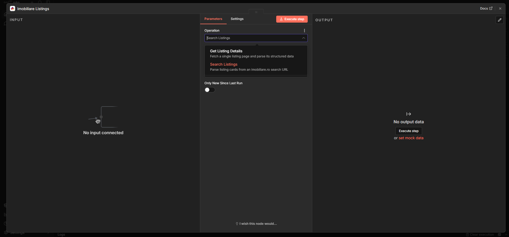
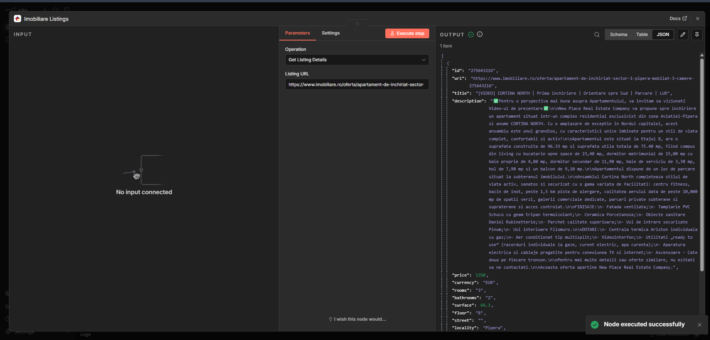
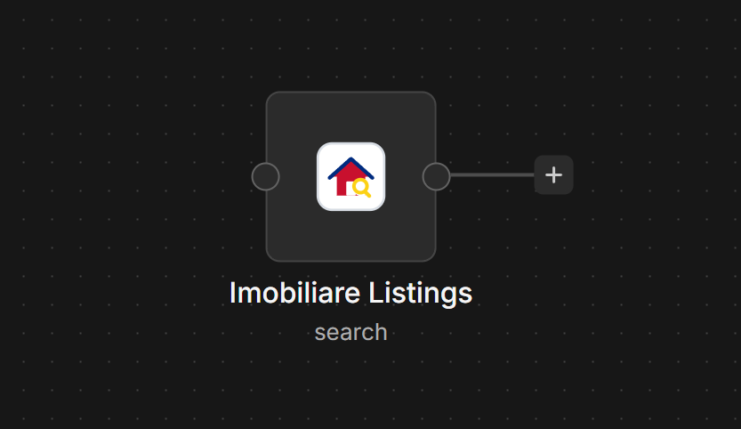

# Imobiliare Listings

Searches and monitors **imobiliare.ro**, Romania's largest real-estate portal, for
property listings and price drops. Returns price, location, surface, rooms, agent, and
the listing URL. No API key.

Despite the site being a modern web app, the search results and listing pages are
**server-rendered**, so this node reads them directly with `httpRequest` — no browser
automation needed.

## How it works

imobiliare.ro filters are encoded in the **search URL**. Apply your filters on the site
(location, rooms, price range, surface…), copy the resulting URL, and give it to the
node. It then reads every result card — including the **price-drop** flag the site shows
("Preț vechi") — and can return only listings it hasn't seen before.

## Operations

### Search Listings
Parse listing cards from an imobiliare.ro search URL.

| Param | Description |
| --- | --- |
| **Search URL** | An imobiliare.ro search URL with your filters applied. |
| **Max Results** | How many listings to return (pages are fetched as needed). |
| **Only New Since Last Run** | Emit only listings not seen on previous runs (for scheduled monitoring). |

Output per listing: `id`, `url`, `title`, `price`, `currency`, `oldPrice`,
`priceDropped`, `rooms`, `surface`, `floor`, `location`.

### Get Listing Details
Fetch one listing page and parse its schema.org data.

| Param | Description |
| --- | --- |
| **Listing URL** | A full imobiliare.ro `/oferta/...` URL. |

Output: `price`, `currency`, `title`, `description`, `rooms`, `bathrooms`, `surface`,
`floor`, `street`, `locality`, `region`, `agentName`, `agentUrl`, `contactName`, and more
— read from the page's JSON-LD, so it is robust to layout changes.

## Monitoring (the trigger use case)

Run **Search Listings** with **Only New Since Last Run** on a Schedule Trigger. The node
remembers seen listing IDs in the workflow's static data, so each run emits only new
listings; the `priceDropped` flag covers the price-drop case. See the example workflow.

## Data source

- Search: `GET <your imobiliare.ro search URL>` (cards are server-rendered HTML)
- Detail: `GET <listing /oferta/ URL>` (schema.org JSON-LD)

## Example

See [`workflows/imobiliareListings-example.json`](../../workflows/imobiliareListings-example.json):
every 2 hours, search for new apartments → Telegram message per new listing → log to a
sheet.

## Screenshots

**Search Listings** — the node configured with its output:

The two operations:

**Get Listing Details**:

On the canvas:

## Notes

- Uses n8n's built-in `this.helpers.httpRequest`.
- The search-card parser reads server-rendered markup, so it can break if imobiliare.ro
  changes its layout; the detail parser uses JSON-LD and is more stable. Data ©
  imobiliare.ro; unofficial node, not affiliated.
